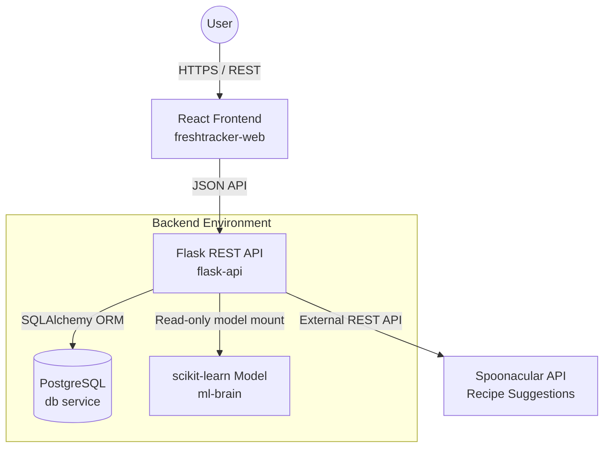

# FreshTracker

FreshTracker is a full-stack food waste tracking platform that helps users manage grocery inventory, track expiry dates, log waste outcomes, and receive recipe suggestions based on ingredients that are close to expiring.

## Architecture

FreshTracker is split into three main parts: a React frontend, a Flask REST API, and a separate machine learning pipeline for grocery category prediction.



## Features

- Email/password authentication with session-based login
- CSRF protection for state-changing requests
- Inventory tracking with expiry status classification
- Waste logging for used and discarded items
- Category-level waste analytics
- Recipe suggestions based on ingredients close to expiry
- Automated grocery category prediction using a TF-IDF + Naive Bayes model
- Scheduled expiry-alert workflow
- PostgreSQL migrations with Alembic
- Docker Compose setup for local development
- Pytest coverage for backend and ML logic

## Key Design Decisions

### Separation of Concerns

The machine learning training pipeline lives separately from the runtime API. The API loads a pre-trained model from `ml-brain`, which keeps training code separate from request-handling code and avoids adding unnecessary training steps to the API startup path.

### Database and ORM

FreshTracker uses Flask-SQLAlchemy with Alembic migrations. This keeps database changes versioned and repeatable, while the ORM keeps query construction structured and reduces the need for unsafe raw SQL.

### Containerized Development

The frontend, backend, and PostgreSQL database are defined in Docker Compose so the full application can be started consistently during local development.

### Authentication and Request Safety

The API uses session cookies for authentication and CSRF tokens for state-changing requests. Inventory and waste records are scoped to the authenticated user so users can only access their own data.

## Repository Structure

```text
FreshTracker/
├── docker-compose.yml       # Orchestrates frontend, API, scheduler, and PostgreSQL
├── flask-api/               # Flask REST API, SQLAlchemy models, tests, and migrations
├── freshtracker-web/        # React/Vite frontend and Nginx configuration
└── ml-brain/                # scikit-learn training pipeline and saved category model
```

## Local Development Setup

### Prerequisites

- Docker
- Docker Compose

### 1. Clone the repository

```bash
git clone https://github.com/michaelkomolafe2/FreshTracker.git
cd FreshTracker
```

### 2. Configure environment variables

Create a `.env` file in the repository root.

```env
POSTGRES_DB=freshtracker
POSTGRES_USER=freshtracker
POSTGRES_PASSWORD=freshtracker_password
DATABASE_URL=postgresql://freshtracker:freshtracker_password@db:5432/freshtracker
SECRET_KEY=replace-with-a-secure-random-secret
SPOONACULAR_API_KEY=your_api_key_here
MAIL_ENABLED=false
```

`SPOONACULAR_API_KEY` is optional for local development, but recipe suggestions that call the external provider require a valid key.

### 3. Start the application

```bash
docker-compose up --build
```

Database migrations run automatically when the API container starts.

The frontend is available at:

```text
http://localhost:5173
```

The API health check is available at:

```text
http://localhost:5000/health
```

## Testing

The backend includes pytest coverage for core API flows, validation, authentication, recipe caching, expiry logic, and ML-related logic.

### Run backend tests

```bash
docker-compose exec flask-api pytest
```

### Run ML pipeline tests

```bash
cd ml-brain
pytest
```

## Machine Learning Model

FreshTracker uses a scikit-learn pipeline to predict grocery categories from item names.

Current model approach:

- TF-IDF vectorization
- unigram and bigram text features
- Multinomial Naive Bayes classifier
- train/test split evaluation

Training entry point:

```bash
cd ml-brain
python train_model.py
```

The saved model is loaded by the Flask API at runtime to categorize new inventory items when a category is not provided manually.

## API Overview

Core API areas:

- `POST /auth/register` - create a user account
- `POST /auth/login` - authenticate a user
- `POST /auth/logout` - end the current session
- `GET /auth/me` - return the current authentication state
- `GET /items` - list the authenticated user's active inventory items
- `POST /items` - create a new inventory item
- `PATCH /items/<item_id>` - mark an item as used or wasted
- `GET /waste-logs/category-summary` - summarize used/wasted outcomes by category
- `GET /recipe-suggestions` - suggest recipes from current inventory
- `POST /recipe-suggestions` - suggest recipes from a provided ingredient list
- `GET /health` - check API and database availability

## Security Notes

- Authentication uses HTTP-only session cookies.
- CSRF tokens are required for state-changing requests.
- User-owned resources are scoped by authenticated user ID.
- Passwords are stored as hashes, not plaintext.
- Secrets and API keys should be provided through environment variables and should not be committed.

## Known Limitations

- Recipe suggestions depend on the availability and quota of the external Spoonacular API.
- The category model is trained on a limited grocery dataset and may misclassify ambiguous or uncommon item names.
- The current deployment setup is designed for local development and demonstration rather than high-scale production traffic.

## Future Improvements

- Add a public live demo deployment
- Add frontend component tests
- Add GitHub Actions CI for backend, ML, and frontend checks
- Add structured request logging and request IDs
- Add benchmark results for inventory and expiry-alert queries
- Expand model evaluation with dataset size, accuracy, and known failure cases

